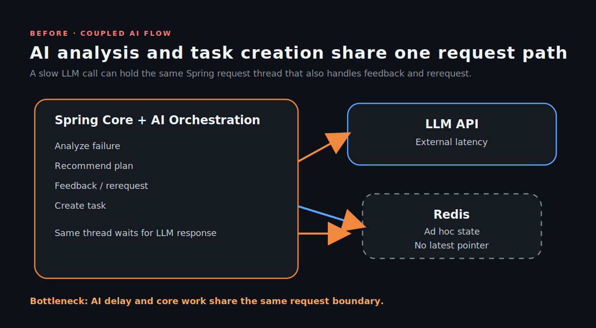
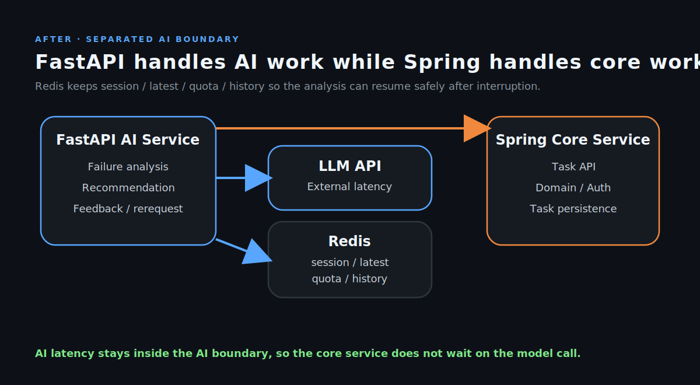
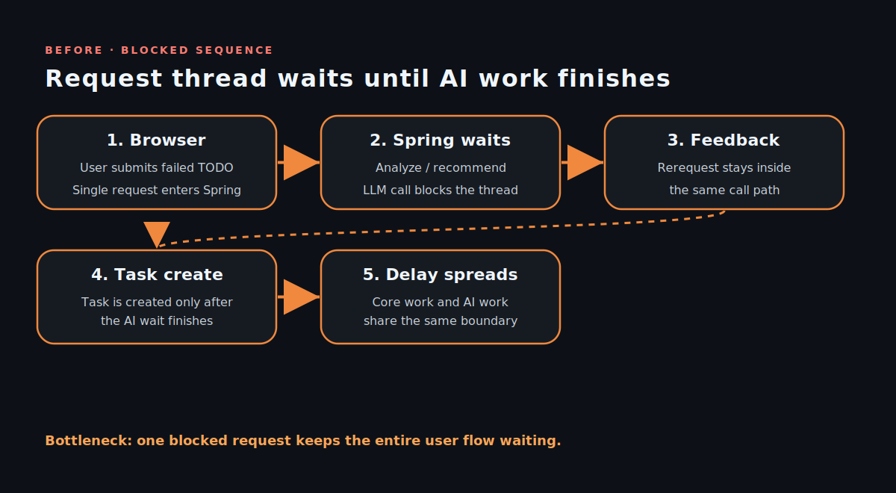
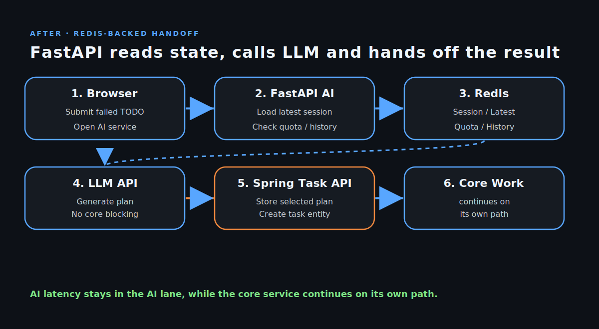

# Case D. AI 오케스트레이션 파이프라인 구축 및 서비스 경계 분리

> 기준일: 2026-03-29
> 비교축: `Before (Coupled AI Flow / Shared State) -> After (Separated AI Boundary / Stateful Session & Loose Coupling)`

## 요약 (REVIEWER SUMMARY)

- 실패한 TODO를 분류·추천·피드백·재요청으로 연결하는 AI 파이프라인을 구축했습니다.
- FastAPI AI 서비스와 Spring 코어 서비스를 분리해, 외부 LLM 지연에 따른 장애 전파를 격리했습니다.
- Redis에 session/latest/quota/history를 저장하고 분석 세션을 Stateful하게 관리해, 중단 후에도 흐름을 복구할 수 있게 했습니다.

## TECH DETAIL

- FastAPI
- Spring Boot 3.5
- Redis
- Qdrant
- Gemini API
- Loosely Coupled Architecture

## 문제 (PROBLEM)

실패한 TODO와 업무 습관을 분석해 실행 계획으로 바꾸는 AI 흐름이 하나의 요청 경로에 묶여 있어, LLM 응답이 지연되면 분석과 핵심 로직 처리가 함께 흔들릴 수 있는 구조였습니다. 또한 세션을 닫았다가 다시 돌아와도 최신 분석 상태를 이어 받을 수 있는 복구 경로가 필요했습니다.

1. **AI 흐름과 업무 실행의 결합**: 실패 분석, 추천, 피드백, 재요청, Task 생성이 한 흐름에 섞여 있어 책임 경계가 흐려졌습니다.
2. **외부 LLM 지연의 전파 가능성**: 긴 응답 대기가 발생하면 분석 로직이 끝날 때까지 후속 작업도 함께 늦어질 수 있었습니다.
3. **세션 복구와 상태 정합성 필요**: 사용자가 브라우저를 닫고 다시 돌아왔을 때 최신 분석 세션과 재요청 이력을 이어 받아야 했습니다.

## 해결 (ACTION)

FastAPI와 Spring의 책임을 분리하고, Redis에 session/latest/quota/history를 저장해 상태를 복구 가능하게 만들었습니다. 선택된 추천은 Spring Task로 넘기는 후속 흐름으로 연결해 AI 추론과 업무 실행을 느슨하게 결합했습니다.

1. **AI 오케스트레이션 분리**:
   - FastAPI가 실패 분석, 추천 생성, 피드백, 재요청을 담당하도록 구성했습니다.
   - Spring은 실제 Task 생성과 핵심 업무 처리에 집중하도록 역할을 분리했습니다.
2. **Redis 기반 상태 제어**:
   - LLM 호출 세션, 최신 포인터, Quota, 재요청 이력을 Redis에 저장해 흐름을 복구 가능하게 만들었습니다.
   - 최신 세션을 다시 찾아 이어서 분석할 수 있도록 상태 조회 경로를 분리했습니다.
3. **Task handoff 연결**:
   - 사용자가 선택한 추천 결과는 단순 텍스트 응답이 아니라 Spring Task 생성으로 이어지도록 연결했습니다.
   - AI 결과가 실제 업무 실행으로 이어지도록 후속 파이프라인을 구성했습니다.

## 결과 (IMPACT)

외부 LLM 지연에 따른 장애 전파를 격리해 코어 서비스 응답성을 유지했고, 분류→추천→피드백→재요청→Task 생성의 흐름이 독립적으로 이어지도록 정리했습니다. 향후 worker split과 개인화 추천 고도화로 확장하기 쉬운 서비스 경계도 확보했습니다.

- **장애 전파 격리**: 외부 LLM 지연이 코어 업무 흐름으로 번지지 않도록 경계를 분리했습니다.
- **복구 가능한 세션 흐름**: Redis 최신 포인터와 상태 저장으로 중단 후 이어하기가 가능해졌습니다.
- **실행 연결성 확보**: 추천 결과가 Spring Task 생성으로 이어져 실제 업무 실행과 연결되었습니다.

## 시각 자료

### 구조도

### 시퀀스

## 향후 확장

- worker split
- cluster_summaries 기반 개인화 추천
- 성공 패턴 / 실패 해결책 기반 재정렬
